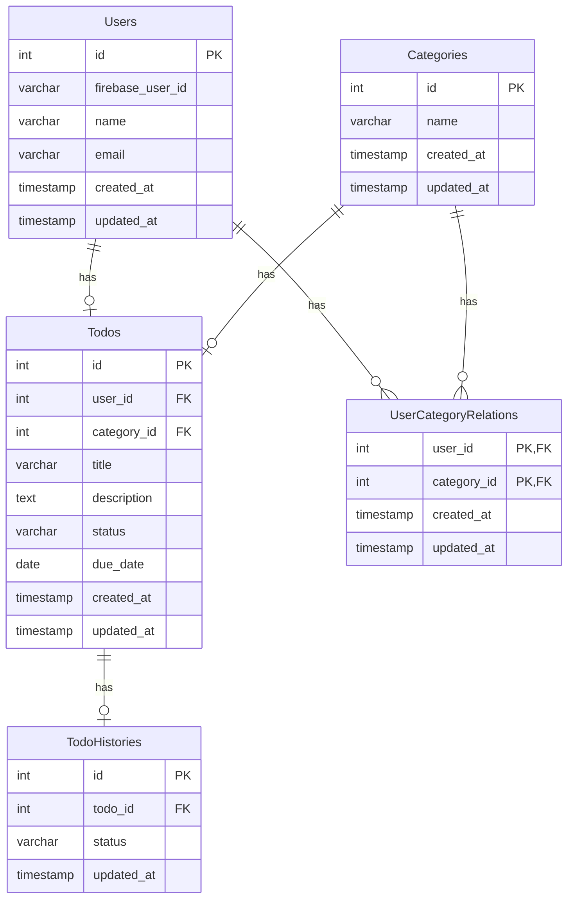

## TODO アプリの ER 図(GPT とペアプロ形式で作成したもの)

ER 図はまだ知見が足りないので勉強中。

実装優先するために GPT を活用してマーメイド記法で作成しました。

```mermaid
%%{
  init: {
    'themeCSS': '[id^=entity-Users] .er.entityBox { fill: #006699; } [id^=entity-Categories] .er.entityBox { fill: #006699; } [id^=entity-Todos] .er.entityBox { fill: #006699; } [id^=entity-TodoHistories] .er.entityBox { fill: #A03B00; } [id^=entity-UserCategoryRelations] .er.entityBox { fill: #005E0B; } '
  }
}%%

erDiagram
    Users {
        int id PK
        varchar firebase_user_id
        varchar name
        varchar email
        timestamp created_at
        timestamp updated_at
    }
    Categories {
        int id PK
        varchar name
        timestamp created_at
        timestamp updated_at
    }
    Todos {
        int id PK
        int user_id FK
        int category_id FK
        varchar title
        text description
        varchar status
        date due_date
        timestamp created_at
        timestamp updated_at
    }
    TodoHistories {
        int id PK
        int todo_id FK
        varchar status
        timestamp updated_at
    }
    UserCategoryRelations {
        int user_id PK, FK
        int category_id PK, FK
        timestamp created_at
        timestamp updated_at
    }
    Users ||--o| Todos: "has"
    Categories ||--o| Todos: "has"
    Todos ||--o| TodoHistories: "has"
    Users ||--o{ UserCategoryRelations: "has"
    Categories ||--o{ UserCategoryRelations: "has"

```
